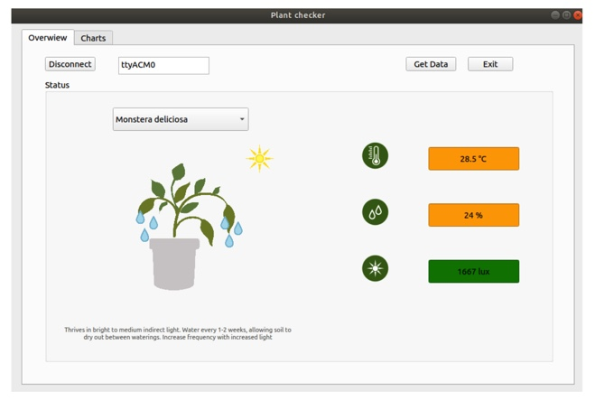
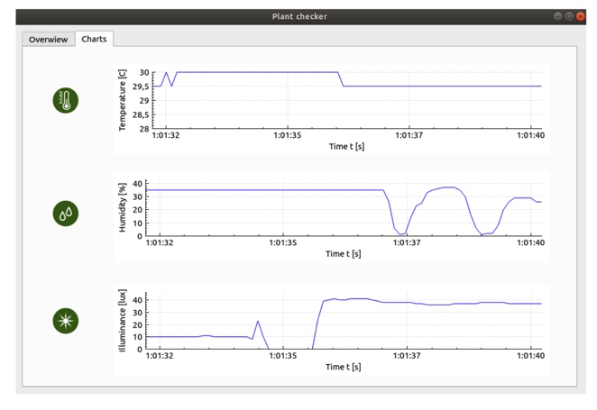

# QTPlantStatus
This project has been created paralleral to an Arduino project. The main goal consist into create an application using QT and C++ to get data from the Arduino and visualize them. 

